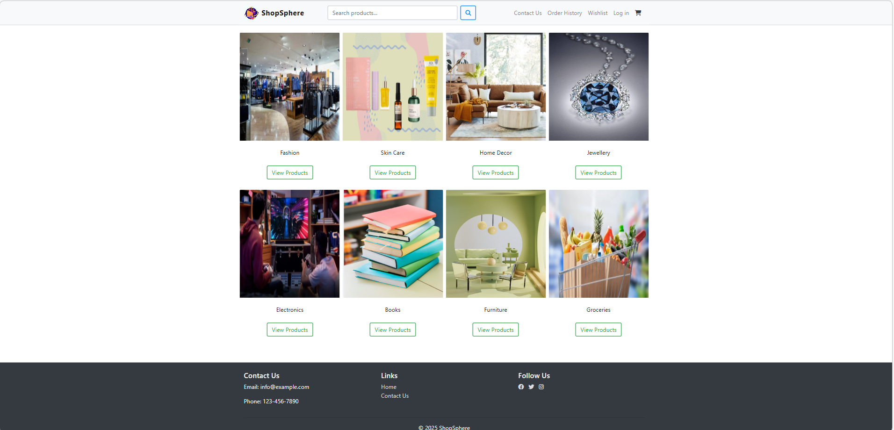
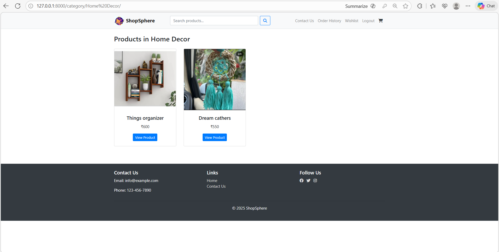
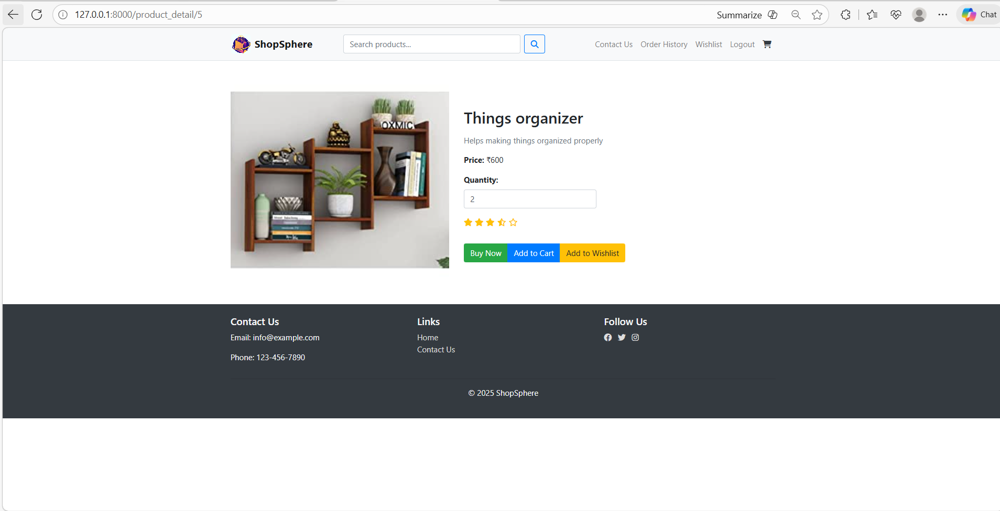
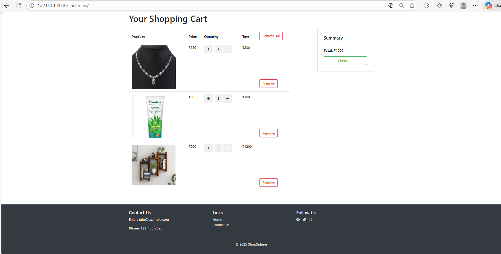
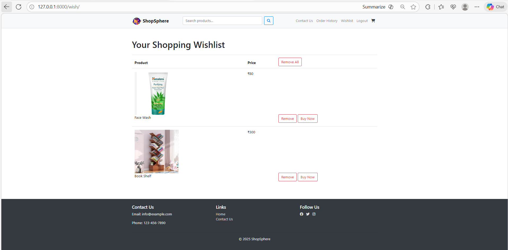
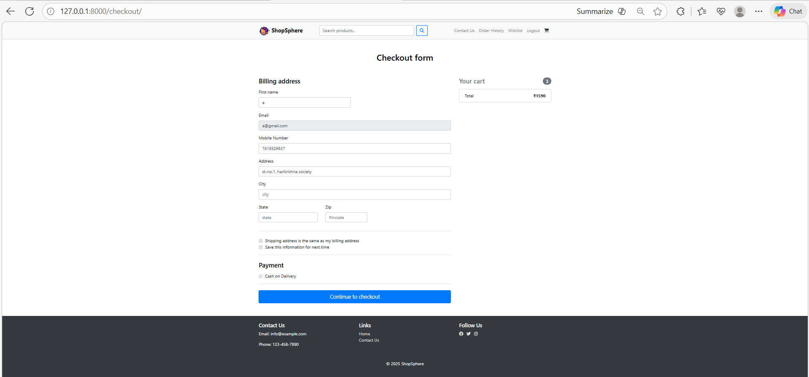
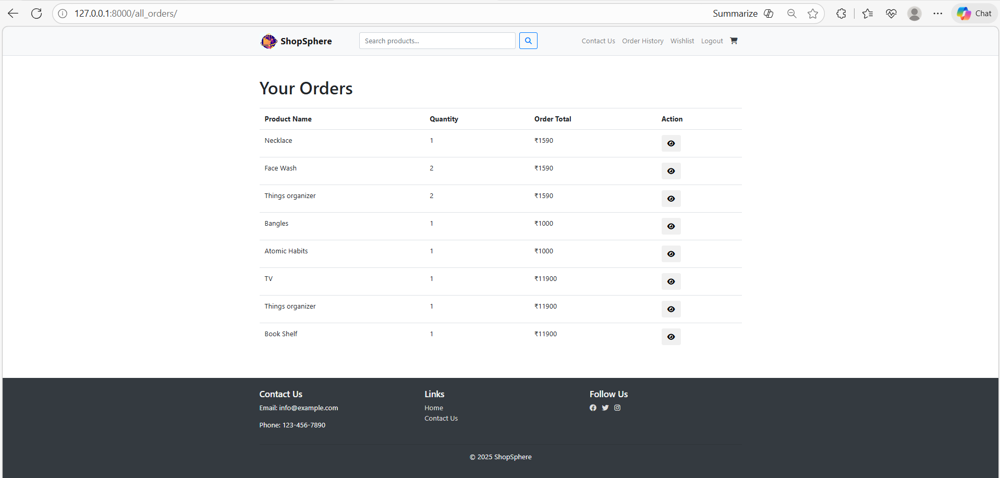
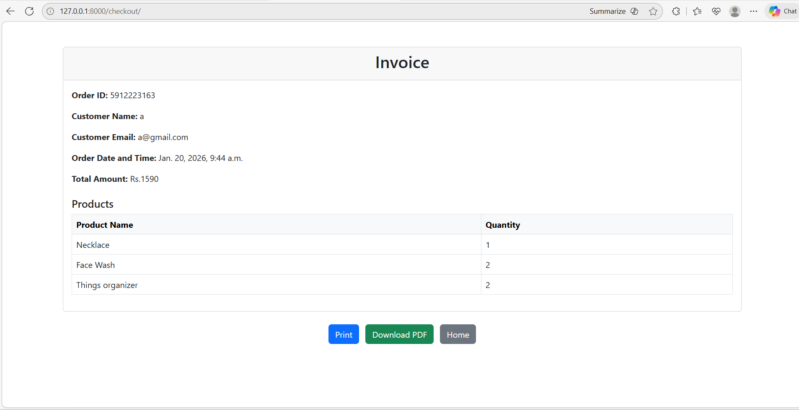

## ShopSphere

ShopSphere is a full-stack e-commerce web application developed using Python and Django, following the Model–View–Template (MVT) architecture.The application provides a complete online shopping experience with secure authentication, product management, cart functionality, wishlist functionality and order processing.

## 1. Features

User authentication (signup, login, logout)

Product listing with detailed product views

Shopping cart functionality

Order placement and order management

Secure handling of users, products, and orders

Responsive and user-friendly UI for smooth browsing and checkout

## 2. Screenshots

### Home Page

### Product Listing

### Prodcut Details

### Shopping Cart

### Wishilist Page

### Checkout Page

### Order History Page

### Invoice 

## 3. Technology Stack

Backend: Python, Django

Frontend: HTML, CSS, Bootstrap

Database: SQLite

Architecture: MVT (Model–View–Template)

## 4. Database Management

Used Django ORM for efficient database operations

Managed relationships between users, products, carts, and orders

Ensured data integrity and scalability

## 5.Installation and Setup

1. Clone the repository  
   git clone https://github.com/Jiya2406/ShopSphere.git

2. Navigate to the project directory  
   cd pro

3. Create a virtual environment  
   python -m venv venv

4. Activate the virtual environment  
   - Windows  
     venv\Scripts\activate  
   - Linux / macOS  
     source venv/bin/activate

5. Install required dependencies  
   pip install -r requirements.txt

6. Apply database migrations  
   python manage.py migrate

7. Create a superuser (optional, for admin access)  
   python manage.py createsuperuser

8. Run the development server  
   python manage.py runserver

9. Open the application in the browser  
   http://127.0.0.1:8000/

## 6. Folder Structure

models.py – Database models

views.py – Application logic

templates/ – HTML templates

static/ – CSS and static assets

urls.py – URL routing

settings.py – Project configuration

## 7. Future Enhancements

Payment gateway integration

Admin dashboard enhancements

Deployment on cloud platforms
